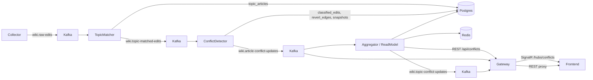

# Three Revert Watch Dataflow

## Event Flow

1. `Collector` reads recent changes from Wikipedia and emits `RawEditEvent`.
2. `TopicMatcher` checks manual seeds, exact titles, include/exclude title keywords, stored `topic_articles`, and cached Wikipedia page categories.
3. Confirmed/high-confidence matches are emitted as `TopicMatchedEditEvent`.
4. Candidate/low-confidence matches are stored as `Candidate` memberships and may be reviewed manually later.
5. `ConflictDetector` fetches minimal revision metadata: ids, parent id, sha1, user, timestamp, comment, tags, size.
6. `ConflictDetector` classifies the edit action and updates per-article runtime state.
7. It emits `ArticleConflictUpdateEvent` with the full `ArticleConflictSnapshotDto`.
8. `Aggregator` stores the article snapshot, recomputes `TopicSnapshotDto`, caches hot snapshots, and emits topic updates.
9. `Gateway` serves REST endpoints and broadcasts SignalR messages:
   - `TopicSnapshotUpdated`
   - `ArticleConflictUpdated`
   - `ConflictAlert`

## Public API

- `GET /api/conflicts/topics`
- `GET /api/conflicts/topics/{topicId}`
- `GET /api/conflicts/topics/{topicId}/articles`
- `GET /api/conflicts/topics/{topicId}/articles/{pageId}`
- `GET /api/conflicts/topics/{topicId}/articles/{pageId}/edits`
- `GET /api/conflicts/topics/{topicId}/articles/{pageId}/participants`

## SignalR Groups

- `conflict-topics`
- `conflict-topic:{topicId}`
- `conflict-article:{topicId}:{pageId}`
